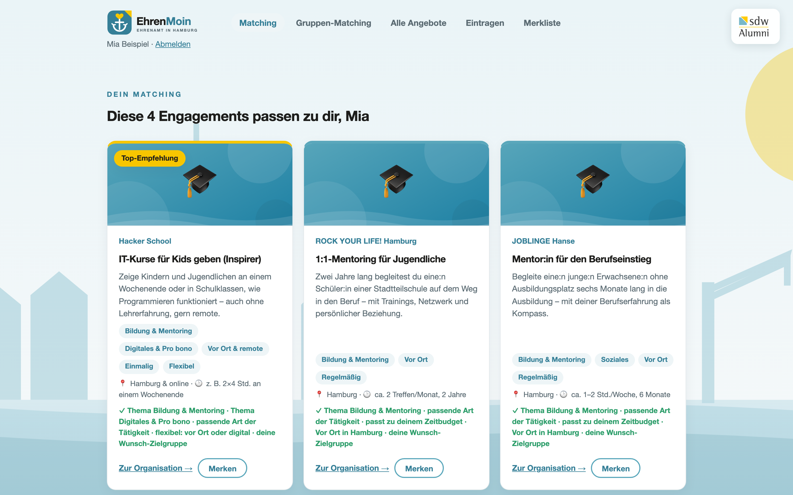

# sdw Alumni – Hackathon: Agenten, Harnesses & soziales Engagement

Materialien für einen Workshop + Mini-Hackathon der **sdw Alumni** ("Netzwerk fürs Leben").
Ziel: erklären, wie aus einem Sprachmodell ein handelnder **Agent** wird – und das Gelernte
direkt nutzen, um etwas Gemeinnütziges zu bauen.

## Inhalt

| Datei / Ordner | Zweck |
|---|---|
| `praesentation.html` | Deutschsprachige Workshop-Präsentation (≈ 10–12 Min) zu LLMs, Harnesses, Kontext, Subagenten & Skills, im sdw-Alumni-Look. |
| `.claude/skills/` | Wiederverwendbare Claude-Code-Skills für den Hackathon (siehe unten). |
| `.env` | Lokale Secrets (z. B. `NGROK_AUTHTOKEN`) – **nicht eingecheckt** (gitignored). |
| `.env.example` | Vorlage zum Kopieren nach `.env`. |

## Präsentation ansehen

Einfach im Browser öffnen – keine Abhängigkeiten, läuft offline:

```bash
open praesentation.html        # macOS
# oder die Datei per Doppelklick öffnen
```

**Steuerung:** `→` / `←` (oder Klick rechts/links) blättern · `F` Vollbild ·
Fortschrittsbalken oben, Folienzähler unten rechts. Beamer-tauglich.

## Mini-Hackathon

Baut mit einem Agenten (z. B. Claude Code) in kurzer Zeit etwas Echtes:

- **Option A – Engagement-Portal:** Website, die Wege zum sozialen Engagement entdeckbar macht
  (Initiativen finden, nach Thema/Ort filtern, Mitmach-Möglichkeiten zeigen).
- **Option B – Initiative-Website:** Auftritt für eine soziale Initiative eurer Wahl
  (Mission, Mitmachen, Spenden, Kontakt).

Ablauf: **Team & Idee (5 Min) → Plan → Bauen → 2-Min-Pitch.**

## Skills

Drei projektlokale Skills helfen beim schnellen Bauen. Nach Änderungen `/reload-skills`
ausführen, damit Claude Code sie lädt.

- **`sdw-frontend`** – baut UI im sdw-Alumni-Corporate-Design (Farben, Typografie, Tonalität,
  deutsche, inklusive Sprache). Greift bei jeder Web-Oberfläche für sdw / sdw Alumni.
- **`hackathon-prototype`** – scaffoldet einen schnellen Prototyp: **FastAPI**-Backend mit
  einer **JSON-Datei als Datenbank** + **React (Vite)**-Frontend.
- **`ngrok-share`** – macht die lokal laufende App über **ngrok** öffentlich erreichbar;
  liest den Authtoken aus `.env`.

## Einrichtung

```bash
# 1. Secrets anlegen
cp .env.example .env
# .env öffnen und NGROK_AUTHTOKEN eintragen

# 2. Prototyp bauen lassen — in Claude Code z. B.:
#    "Baue mit dem hackathon-prototype-Skill ein Engagement-Portal im sdw-Design."

# 3. Öffentlich teilen
#    "Mach die laufende App mit dem ngrok-share-Skill erreichbar."
```

### Prototyp lokal starten (Standard-Layout des Skills)

```bash
# Backend
cd backend && python3 -m venv .venv && source .venv/bin/activate
pip install -r requirements.txt
uvicorn main:app --reload --port 8000      # API-Docs: http://localhost:8000/docs

# Frontend (neues Terminal)
cd frontend && npm install && npm run dev   # http://localhost:5173
```

## Hackathon-App: „EhrenMoin – Ehrenamt in Hamburg" (`backend/` + `frontend/`)

> **Workshop-Ergebnis des sdw Mini-Hackathons vom 11. Juni 2026.** In wenigen
> Stunden mit Claude Code gebaut – als Beispiel dafür, wie aus einem Agenten ein
> echtes, gemeinnütziges Produkt wird.



Unser Prototyp: Stipendiat:innen und Alumni beantworten **fünf kurze Fragen** und
bekommen **vier passende Ehrenamts-Vorschläge** in Hamburg (oder remote). Dazu:
durchsuchbare Angebotsliste mit Filtern, Merkliste, Demo-Login (simuliert das
sdw-Alumniportal) und ein Formular, über das die Community **eigene
Organisationen/Veranstaltungen einträgt**.

- **Daten:** `backend/data.json` — 24 kuratierte, echte Hamburger Angebote
  (recherchiert aus `docs/datenquellen-ehrenamt.md`); Community-Einträge landen
  in derselben Datei mit `"quelle": "community"`.
- **Matching:** `POST /api/matching` gewichtet Themen ×3, Tätigkeit ×2, Zeit ×2,
  Format ×2, Zielgruppe ×1,5 und liefert die Top 4 mit Begründung.
- **Quiz-Fragen:** zentral in `backend/main.py` (`FRAGEN`) — Wording dort
  anpassen, das Frontend rendert dynamisch.
- **Gruppen-Matching:** Gruppe starten → Code teilen (oder Handy herumreichen) →
  jede:r beantwortet die Fragen → `GET /api/gruppen/{code}/ergebnis` liefert die
  **2 Veranstaltungen, die für alle passen** (max-min-fair: erst zählt die Person
  mit der geringsten Übereinstimmung, dann die Gruppensumme).
- **Bilder:** Logo (`ehrenmoin-logo.svg`), Hamburg-Skyline-Hintergrund und
  Themen-Artworks liegen als offline-fähige SVGs in `frontend/public/`. Mit
  einem `PEXELS_API_KEY` in `.env` lassen sich echte Fotos nachrüsten
  (Skill `stock-image`).
- Starten: siehe „Prototyp lokal starten" oben. Hinweis: Login/Merkliste
  schreiben E-Mails in `data.json` — vor einem Commit `nutzer`/`interessen`
  leeren oder `git checkout backend/data.json`.

## Sicherheit

- **`.env` niemals committen.** Steht in `.gitignore`; der ngrok-Authtoken bleibt lokal.
- Eine ngrok-URL ist öffentlich – keine echten personenbezogenen Daten exponieren.

---

*sdw Alumni · Netzwerk fürs Leben*
